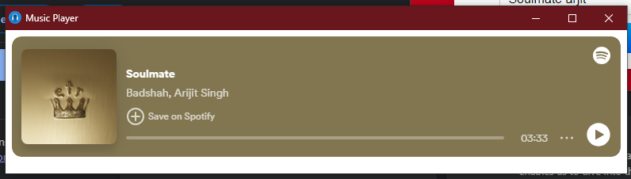
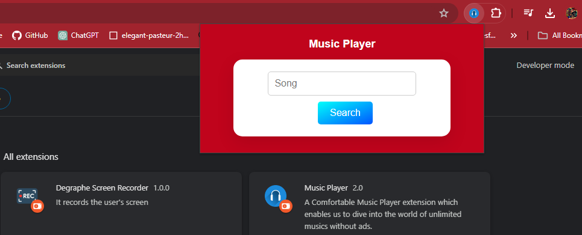
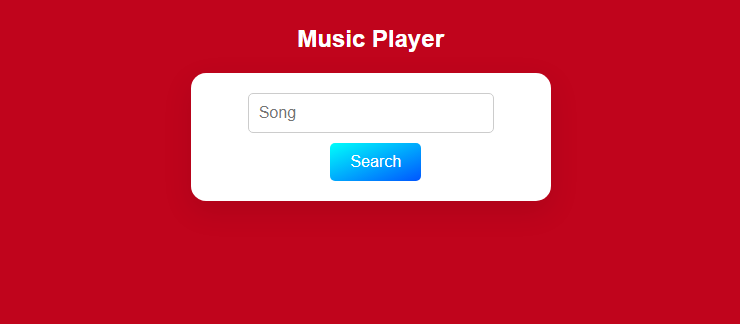
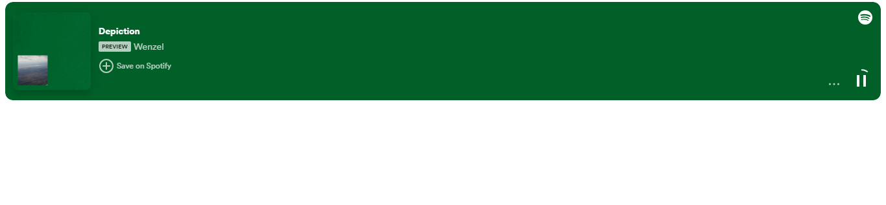

# Spotify Chrome Extension



## Overview

Spotify Chrome Extension is a convenient tool that allows you to search and play any song on Spotify without ads. Whether you're browsing the web or using your Chrome browser, this extension ensures an uninterrupted music listening experience.

### Features

- Play any song on Spotify without ads
- Flexible installation: can be used as a Chrome extension or on a webpage

## Screenshots

### Chrome Extension




### Web Page View





## Installation

### Chrome Extension

1. Clone the GitHub repository:

    ```bash
    git clone https://github.com/AryaGupta01/Spotify-Chrome-Extension.git
    ```

2. Open Chrome and go to `chrome://extensions/`.

3. Enable `Developer mode` in the top right corner.

4. Click on `Load unpacked` and select the cloned `Spotify-Chrome-Extension` directory.

5. The extension should now be installed and ready to use.

### Web Page

You can also use the extension directly from the web:

1. Visit the [Spotify Chrome Extension webpage](https://aryagupta01.github.io/Spotify-Chrome-Extension/).

2. Follow the on-screen instructions to search and play your favorite songs.

## Contributions

We welcome contributions! To contribute to Spotify Chrome Extension, follow these steps:

1. Fork the repository: [https://github.com/AryaGupta01/Spotify-Chrome-Extension](https://github.com/AryaGupta01/Spotify-Chrome-Extension)

2. Create your feature branch:

    ```bash
    git checkout -b feature/my-new-feature
    ```

3. Commit your changes:

    ```bash
    git commit -am 'Add some feature'
    ```

4. Push to the branch:

    ```bash
    git push origin feature/my-new-feature
    ```

5. Create a new Pull Request.

Please make sure to follow the [code of conduct](CODE_OF_CONDUCT.md) and [contribution guidelines](CONTRIBUTING.md) when contributing to this project.

## License

This project is licensed under the MIT License. See the [LICENSE](LICENSE) file for details.
